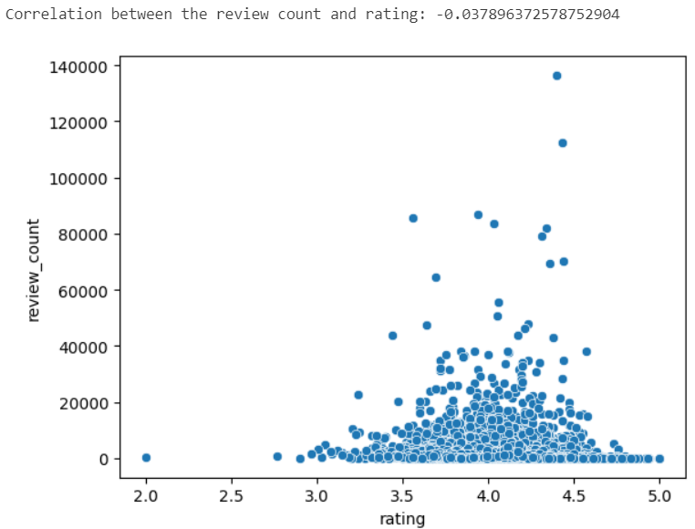
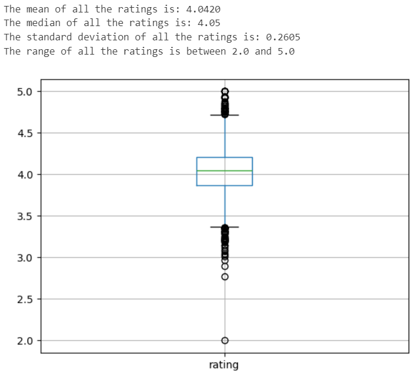

# Exercise 1
import pandas as pd
import numpy as np
import seaborn as sns

data = pd.read_csv('data/goodreads.csv', encoding='utf-8', header=None)
names = ["rating", 'review_count', 'isbn', 'booktype','author_url', 'year', 'genre_urls', 'dir','rating_count', 'name']

data.columns = names

display(data.head())

# Exercise 2
subset = data[['rating', 'isbn', 'author_url', 'year', 'genre_urls', 'name']]
display(subset.head())

# Exercise 3
# Here the missing values are counted per column.
print(subset.isna().sum())

# The rows without a book name or isbn are deleted, since it is not clear which book this is.
subset = subset[subset.name.notnull()]

# The NaN values in genre_urls, isbn and year will be changed to unknown.
subset.loc[subset.genre_urls.isnull(), 'genre_urls'] = 'unknown'
subset.loc[subset.isbn.isnull(), 'isbn'] = 'unknown'
subset.loc[subset.year.isnull(), 'year'] = 'unknown'

# The column author_url will be changed to a string to help with the following exercise.
subset.loc[:, 'author_url'] = subset.author_url.astype(str)

# Exercise 4
# This creates the new author column from the author_url column
subset['author'] = subset['author_url'].str.split('/').str[-1].str.split('.').str[-1]

# Here the data set is sorted by rating from high to low and where there are overlapping rates the earlier year is first
sorted = subset.sort_values(['rating', 'year'], ascending=[False, True])

# how many books were published at each year and find lowest, highest rate of each year
summary = sorted.groupby('year').agg(
    number_of_books = ('author', 'count'),
    lowest_rating = ('rating', 'min'),
    highest_rating = ('rating', 'min'))

# Exercise 5
sorted.to_csv("data/hw03-cleand.csv", index=False, header=True)

# Exercise 6
clean = pd.read_csv('data/cleaned-goodreads.csv')

# Here the correlation coefficient is calculated. There is a little bit of a negative correlation
#   meaning that when the rating count increases the rating decreases
correlation = clean['review_count'].corr(clean['rating'])
print(f'Correlation between the review count and rating: {correlation}')

# Here the scatter plot is created
sns.scatterplot(x='rating', y='review_count', data=clean);

# A book rating is very subjective. When only a few people vote, the vote will represent the opinion of only a few people.
# However, when lots of people vote, the vote will become more of a mean of all the opinions.
# It can be seen that the scatterplot looks a bit like the shape of a normal distribution.

# Exercise 7
print(f'The mean of all the ratings is: {clean.rating.mean():.4f}')
print(f'The median of all the ratings is: {clean.rating.median()}')
print(f'The standard deviation of all the ratings is: {clean.rating.std():.4f}')
print(f'The range of all the ratings is between {clean.rating.min()} and {clean.rating.max()}')

clean.boxplot('rating');

