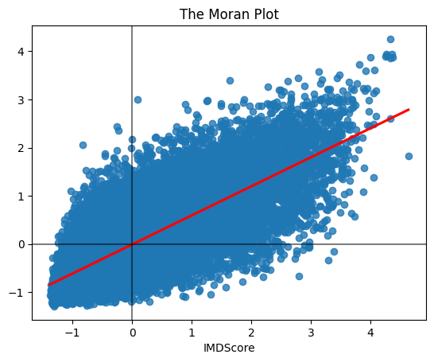

```python
%matplotlib inline

import seaborn as sns
import pandas as pd
import pysal as ps
from pysal.lib import weights
from libpysal.io import open as psopen
import geopandas as gpd
import numpy as np
import matplotlib.pyplot as plt
from pysal.explore import esda
from splot.esda import moran_scatterplot, lisa_cluster, plot_local_autocorrelation
from sklearn.neighbors import NearestNeighbors
import geopy.distance
from geopy.geocoders import Nominatim
```

# Exercise 1
```python
## Veerle

def create_contiguity_weights(df):
    Weights = weights.Queen.from_dataframe(df, use_index=False)   # This costructs the Queen contiguity-based spatial weight matrix
    return Weights

df = gpd.read_file('data/MARKTEN.shp')                            # This loads in the dataset
display(df.head())                                                # Here the dataset is displayed to check if it is usefull

W = create_contiguity_weights(df)                                 # This runs the definition with our chosen dataset

## Below was Veerle's first attempt and together we came up with the code above this.
# lookup_path = 'data/MARKTEN.csv'

# W = weights.Queen.from_dataframe(imd, ids="lsoa11cd")
# return W
```

# Exercise 2
```python
def calculate_morans_i(W, y):       # Here the function is created
    mi = esda.Moran(y, W)           # This calculates the Moran's I with weight matrix W and attribute array y
    return mi, mi.p_sim             # Here the Moran's I value and the p-value are returned

print(f"The Moran's I value is {calculate_morans_i(W, df['LNG'])[0]} and the p-value is {calculate_morans_i(W, df['LNG'])[1]}")
                                    # This prints the Moran's I and its p-value with our dataset

## Below this statement was Veerle's attempt, but we all agreed that there was no definition written, so we added it.

# mi = esda.Moran(y, W) # calculate Moran's I 
# # return Moran's I value and it's p-value 
```

# Exercise 3
```python
## Didier

def standardize_weights(W):
    W.transform = 'R'                                           # This modifies W to a row-based transformation, so every row of the matrix sums up to one
    print(W)                                                    # verify normalisation / check for error

    for unit, weights in W.weights.items():                     # Loop through the spatial weights matrix
        print(f"Unit {unit} weights sum to: {sum(weights)}")    # Create a print that shows the sum of each row

    return (W)                                                  # return the standardized weight matrix

standardize_weights(W)                                          # Check wether the function works for our dataset

## Above this statement was Didier's first attempt and we all agreed that this was the answer.
```

# Exercise 4
```python
## Noor

def create_distance_weights(points, threshold):                         # This creates the function     
    dbmatrix = weights.DistanceBand.from_dataframe(points, threshold)   # Here the distance-based spatial weight matrix is constructed
    return dbmatrix                                                     # this returns the matrix

create_distance_weights(df, 1000)                                       # testing with our dataset, the threshold is in meters


## Below was Noor's first try, but together we figured out that there is another way as shown above

# from sklearn.neighbors import NearestNeighbors
# import geopy.distance
# from geopy.geocoders import Nominatim

# # Load the dataset
# file_path = r'data/IMD/IMD/MARKTEN.csv'
# df = pd.read_csv(file_path, delimiter=';', encoding='utf-8', on_bad_lines='skip')  # it gave an error, so I asked Chat GPT what to do

# # Check the first few rows to inspect the structure
# display(df.head())

# print(df.columns)  # Look for location-related columns

# # Change 'LAT' and 'LNG' to the actual column names in the dataset
# latitude_column = 'LAT'  # Column name for latitude
# longitude_column = 'LNG'  # Column name for longitude

# # Extract coordinates into a list of tuples, scince we can't (and dont want to) change the coordinates 
# coordinates = df[[latitude_column, longitude_column]].values.tolist()

# def create_distance_weights(points, threshold_km=1):
#     # Convert threshold from kilometers to degrees (approx.)
#     threshold = threshold_km / 111  # Roughly, 1 degree is ~111 km
    
#     num_points = len(points)
#     weight_matrix = np.zeros((num_points, num_points))  # Initialize the weight matrix, matrix holds the weights between pairs of points

#     for i in range(num_points):#compare all points against each other 
#         for j in range(num_points):
#             if i != j:  # Don't calculate distance to self
#                 # Calculate Euclidean distance, staight-line distance measuring 
#                 distance = np.sqrt((points[i][0] - points[j][0]) ** 2 + (points[i][1] - points[j][1]) ** 2)
                
#                 # If the distance is less than or equal to the threshold, assign a weight of 1 # meaning thye are neighbors 
#                 if distance <= threshold:
#                     weight_matrix[i][j] = 1
                    
#     return weight_matrix

# points = [[52.3796158, 4.8864808], [52.3567314, 4.8971772], [52.3848801, 4.8838201]] #Noordermarkt, Albert Kuypmarkt and Haarlemmerplein
# weights = create_distance_weights(points)

# # Print the weight matrix
# print(weights)

# # The results say that Noordermarkt and Haarlemmerplein are neigbors and Albert Kuypmarkt is not (for both of the others)
# # If I check at google maps this is correct. Haarlemmerplein and Noordermarkt are less than a kilometer apart!
```

# Exercise 5
```python
## Gina

def plot_moran(W, y):
    # Standardize the attribute array y
    y_standardized = (y - np.mean(y)) / np.std(y)
    
    # Calculate the spatial lag of y
    W.transform = 'R'  # Row-standardize the weights matrix
    spatial_lag = weights.lag_spatial(W, y_standardized)
    
    # Create a Moran scatter plot
    plt.figure()
    sns.regplot(x=y_standardized, y=spatial_lag, ci=None, line_kws={"color": "red"})
    plt.axhline(0, color='k', alpha=0.5)
    plt.axvline(0, color='k', alpha=0.5)

    plt.title('The Moran Plot')
    
    # Save the plot as an image file
    plt.savefig('Moranplot.png')
    plt.show()

plot_moran(w, imd['IMDScore'])


## Above was Gina's first attempt, but we realized here that we couldn't use our own dataset, since there is not really any data in it 
# to make Moran's plots. Below we attempted to make it work but it was not successfull. We still wanted to show that we tried.

# def plot_moran(W, y):
#     # Here the STANDARDIZED VERSION of the IMD score is created
#     df['standard'] = (df[y] - df[y].mean()) / df[y].std()

#     # This calculates the SPATIAL LAG of the standardized score
#     df['spatiallag'] = weights.lag_spatial(W, df['standard'])

#     # Create a Moran scatter plot
#     plt.figure()
#     sns.regplot(x='standard', y='spatiallag', data=df, ci=None, line_kws={"color": "red"})
#     plt.axhline(0, color='k', alpha=0.5)
#     plt.axvline(0, color='k', alpha=0.5)

#     plt.title('The Moran Plot')
    
#     # Save the plot as an image file
#     plt.savefig(file_name, dpi=300)
#     plt.show()
```

